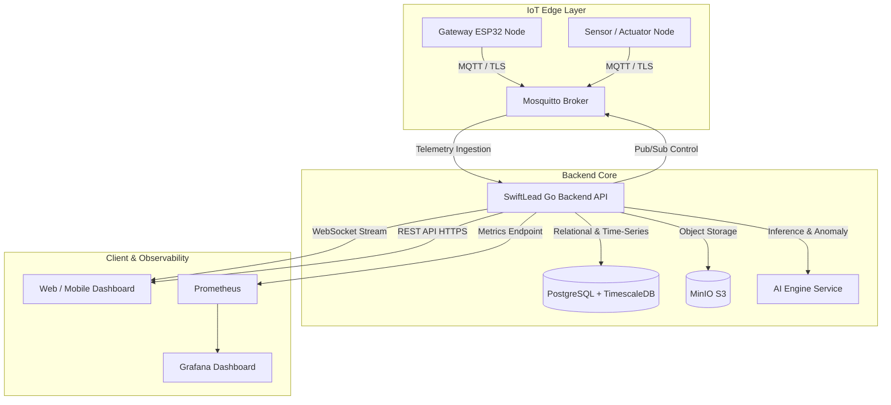

# 🏗️ SwiftLead Backend (v2)

[](https://golang.org)
[](LICENSE)
[](https://www.docker.com)
[](https://www.timescale.com)
[](https://mosquitto.org)
[](https://prometheus.io)
[](https://grafana.com)

**SwiftLead Backend** is a high-performance, modular IoT and ERP backend built with Go for Smart Swiftlet House (*Rumah Burung Walet* / RBW) management and automation. It combines real-time IoT telemetry ingestion, automated environmental control (pumps, audio tweeters, mist sprayers), AI-driven decision pipelines, ERP operational records (harvests, finances, maintenance service requests), and real-time WebSocket client updates.

---

## 🌟 Key Features

- **📡 IoT Telemetry & Control (MQTT + TLS)**
  - Ingestion of environmental sensor data (temperature, relative humidity, ammonia/NH3, RSSI).
  - Actuation control for misting pumps (manual override, duration timer, autonomous mode).
  - Multi-channel audio control (LMB, internal tweeters, pull audio).
- **⚡ Real-time Data Streaming (WebSockets)**
  - Broadcasts real-time telemetry updates and system alerts to authenticated frontend clients.
- **🤖 AI Engine Integration**
  - Real-time sensor anomaly detection.
  - Swiftlet nest quality grade prediction.
  - Automated microclimate regulation decisions.
- **💼 Comprehensive Swiftlet House ERP**
  - Multi-RBW, floor, and node hierarchy management.
  - Harvest recording, grading, and historical statistics.
  - Financial statements, income/expense tracking, and transaction categories.
  - Service requests and maintenance tracking.
- **🔒 Secure Authentication & Role-Based Access Control**
  - JWT authentication with secure password hashing (bcrypt).
  - Role separation: `admin`, `technician`, and `farmer`.
- **📊 Observability & Monitoring**
  - Prometheus metrics instrumentation.
  - Pre-provisioned Grafana dashboards with CPU, memory, and IoT throughput metrics.

---

## 🏛️ Architecture Overview



---

## 🛠️ Tech Stack

- **Core Runtime:** [Go 1.24](https://go.dev/)
- **Database:** [PostgreSQL 16](https://www.postgresql.org/) with [TimescaleDB](https://www.timescale.com/) extension
- **Message Broker:** [Eclipse Mosquitto 2.0](https://mosquitto.org/)
- **Object Storage:** [MinIO](https://min.io/) (S3-compatible)
- **Monitoring:** [Prometheus](https://prometheus.io/) & [Grafana 10](https://grafana.com/)
- **Reverse Proxy / Container:** [Docker](https://www.docker.com/), [Docker Compose](https://docs.docker.com/compose/), Traefik / Nginx

---

## 🚀 Getting Started

### Prerequisites

- [Go](https://go.dev/dl/) 1.24 or later (for local Go development)
- [Docker](https://docs.docker.com/get-docker/) & [Docker Compose](https://docs.docker.com/compose/install/)
- `make` (optional, for Make commands)

---

### Option 1: Quick Start with Docker Compose (Recommended)

1. **Clone the repository:**
   ```bash
   git clone https://github.com/mfuadfakhruzzaki/backend-swiftlead-v2.git
   cd backend-swiftlead-v2
   ```

2. **Configure Environment:**
   ```bash
   cp .env.example .env
   ```
   *(Review `.env` and adjust passwords if needed)*

3. **Start all services:**
   ```bash
   make docker-up
   # or: docker-compose up -d
   ```

4. **Verify Health:**
   ```bash
   curl http://localhost:8080/health
   ```

---

### Option 2: Local Go Development (Bare Metal)

1. **Start infrastructure dependencies (DB, MinIO, Mosquitto):**
   ```bash
   docker-compose up -d db minio mosquitto prometheus grafana
   ```

2. **Run database migrations:**
   ```bash
   go run ./cmd/api -migrate
   ```

3. **Run the backend:**
   ```bash
   make run
   # or with live reload: make dev (requires air)
   ```

---

## 🔌 Default Endpoints & Ports

| Service | Port | Default URL | Description |
| :--- | :--- | :--- | :--- |
| **REST API** | `8080` | `http://localhost:8080` | Core API & Health |
| **WebSocket** | `8080` | `ws://localhost:8080/api/v1/ws` | Real-time Telemetry Stream |
| **PostgreSQL** | `5432` | `localhost:5432` | TimescaleDB |
| **Mosquitto MQTT** | `1883` / `8883` | `tcp://localhost:1883` | MQTT Broker (TCP / TLS) |
| **MinIO Console** | `9001` | `http://localhost:9001` | S3 Storage Dashboard (`minioadmin` / `minioadmin`) |
| **Prometheus** | `9090` | `http://localhost:9090` | Metrics Scraper |
| **Grafana** | `3000` | `http://localhost:3000` | Analytics UI (`admin` / `swiftlet_admin`) |

---

## 🧪 Testing & Verification

Run automated test suites:
```bash
# Run unit & integration tests
make test

# Run tests with race detection
make test-race

# Generate HTML coverage report
make cover
```

Load and stress test with [k6](https://k6.io/):
```bash
k6 run loadtest/stress_test.js
```

---

## 📚 Documentation & Guides

- 📖 **[API Documentation](API_DOCUMENTATION.md)** — Complete reference for all REST and WebSocket endpoints.
- 📡 **[MQTT Hardware Guide](MQTT_HARDWARE_GUIDE.md)** — Topic structures, payload schemas, and ESP32 firmware integration examples.
- 📮 **[Postman Collection](SwiftLead_v2.postman_collection.json)** & **[Environment](SwiftLead_v2.postman_environment.json)** — Ready-to-import Postman workspace.

---

## 🔐 Security Best Practices

- Never commit `.env` or `.env.production` files containing live secrets.
- Always replace default passwords (`JWT_SECRET`, `DB_PASSWORD`, `MINIO_SECRET_KEY`) before running in production.
- Use TLS/SSL for MQTT broker connections (`8883`) in production environments.

---

## 📄 License & Copyright

Copyright (c) 2026 Muhammad Fuad Fakhruzzaki. All Rights Reserved.

This repository is **proprietary** and made publicly visible strictly for portfolio, showcase, and evaluation purposes. Unauthorized copying, distribution, modification, or commercial use of this codebase is strictly prohibited. See the [LICENSE](LICENSE) file for details.
